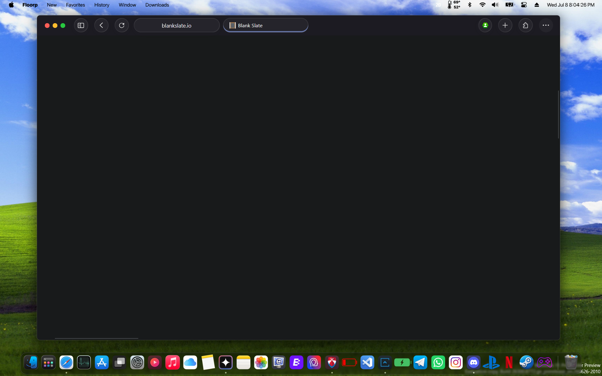
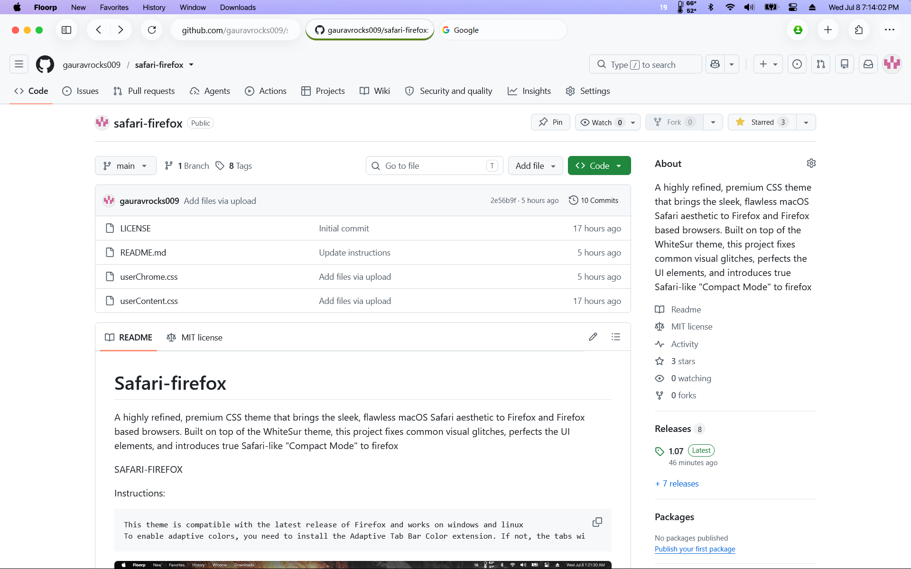
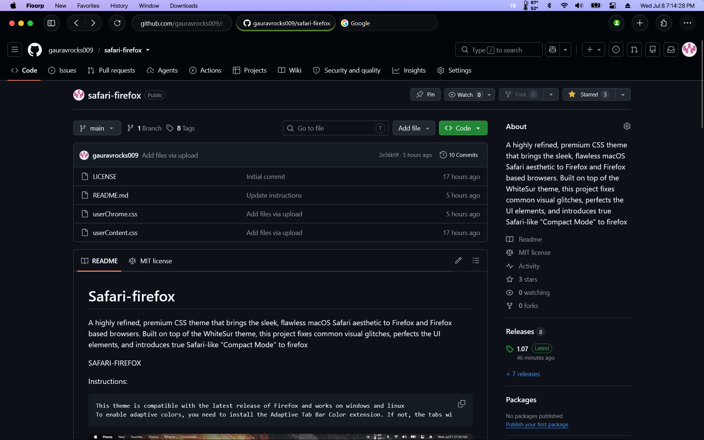
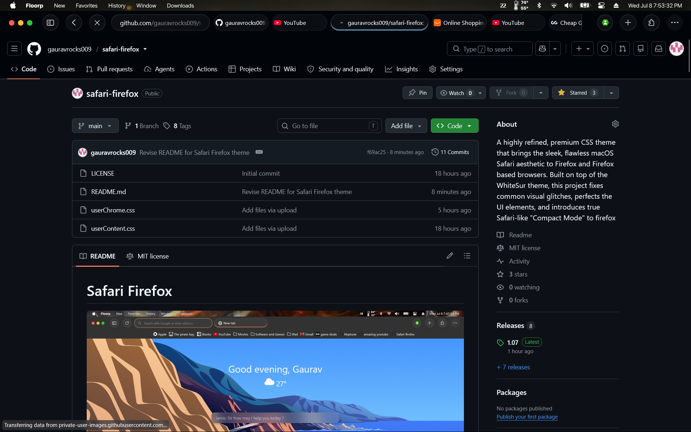

# Safari Firefox



<p align="center">
A highly refined, premium CSS theme that transforms Firefox into a browser inspired by modern macOS Safari while preserving everything that makes Firefox powerful.
</p>
## Light Mode

<p align="center">
  
</p>

## Dark Mode

<p align="center">
  
</p>

# Why Safari Firefox?

Let's be honest.

Your browser is probably the application you use more than anything else. Whether you're coding, studying, watching videos, or simply browsing the web, it's open almost the entire day.

So why shouldn't it look beautiful?

**Safari Firefox** was created with one goal: make Firefox feel as polished, elegant, and premium as Safari without sacrificing Firefox's customization, extensions, privacy, and performance.

Built on top of the excellent **WhiteSur** theme, Safari Firefox fixes countless visual inconsistencies, refines nearly every UI element, improves stability, and recreates Safari's signature compact browsing experience.

---

# Headline Feature — Ultra-Compact One-Line UI


Unlike stock Firefox, Safari Firefox merges the **Tab Bar** and **Navigation Bar** into one beautiful continuous row.

## Why it matters

- Saves valuable vertical screen space.
- Gives more room to webpages.
- Cleaner, modern appearance.
- Less clutter.

- Automatically adapts to different window sizes.
- Works out of the box on a fresh Firefox installation.

Instead of wasting an entire toolbar for tabs, everything fits elegantly into a single row—just like Safari.

---

# Premium Liquid Glass UI

Every popup and menu throughout Firefox has been redesigned with a premium translucent "Liquid Glass" appearance inspired by Apple's latest interface.

Instead of flat gray menus, Safari Firefox introduces:

- Heavy background blur
- Beautiful transparency
- Soft rounded corners
- Premium shadows
- Better spacing
- Modern typography

Every menu feels consistent across the browser.

This includes:

- Right-click context menus
- Firefox application menu
- Overflow menus
- Popup panels
- Toolbar menus

The screenshots below showcase this effect.


# Beautiful Vertical Tabs

Safari Firefox fully supports Firefox's Vertical Tabs.

The sidebar has been redesigned to look lightweight, elegant and unobtrusive.

When **Expand on Hover** is enabled, the sidebar stays compact while browsing and smoothly expands only when your cursor approaches it.

Benefits include:

- Better multitasking
- Longer tab titles
- Cleaner desktop
- More content space
- Gorgeous animations

---

# 🔍 Smart Expanding Search Bar

The address bar intelligently expands whenever you hover over it, giving you more room for long URLs while keeping the toolbar compact when not in use.

---

# Accent-Colored Active Tab

The active tab is highlighted with a clean underline that automatically follows your system accent colour, making it immediately obvious which tab is active while maintaining a native look.

---

# Highly Customizable

Almost every toolbar button can be customized.

Simply right-click the toolbar and choose **Customize Toolbar**.

You can rearrange, remove, or add nearly every button to suit your workflow.

The only fixed elements are:

- Traffic lights
- Three-dot menu
- Search bar

Everything else is yours to customize.

---

# Compatibility

- Latest Firefox Release
- Windows
- Linux

---

# Installation

## 1. Open your Firefox profile

- Open Firefox.
- Visit `about:profiles`.
- Click **Open Folder** for your default root profile.

---

## 2. Download Safari Firefox

Download the latest release from GitHub.

Extract it.

Copy:

- `userChrome.css`
- `userContent.css`

---

## 3. Create the chrome folder

Inside your Firefox profile create:

```text
chrome
```

Copy both CSS files inside.

---

## 4. Enable Custom CSS

Visit:

```text
about:config
```

Enable these preferences:

| Preference | Value |
|------------|-------|
| toolkit.legacyUserProfileCustomizations.stylesheets | true |
| svg.context-properties.content.enabled | true |
| widget.non-native-theme.use-theme-accent | true |

Restart Firefox.

# Customize Your Toolbar

After installation:

- Right-click the toolbar.
- Select **Customize Toolbar**.

Arrange the interface however you like.

---

# Optional — Adaptive Tab Bar

For an even more immersive experience, install the **Adaptive Tab Bar Colour** extension.

It automatically changes the browser's top bar to match the dominant colour of the current webpage, making the browser chrome blend seamlessly with the website.

The result is a much more immersive experience where the browser almost disappears and the webpage feels like it extends across the entire window.
heres the direct link for the extension-https://addons.mozilla.org/en-US/firefox/addon/adaptive-tab-bar-colour/
---

# Optional — Enable Vertical Tabs

1. Right-click the top toolbar.
2. Enable **Vertical Tabs**.
3. Open the Sidebar.
4. Click **Customize Sidebar**.
5. Enable **Expand on Hover**.

---


# Suggestions & Issues

Found a bug?

Have a feature request?

Please open an Issue on GitHub.

You can also contact me directly via email.

Every suggestion helps improve Safari Firefox.

---

# Support

If you enjoy Safari Firefox, please leave the repository a ⭐.

It helps more people discover the project and motivates future updates.
